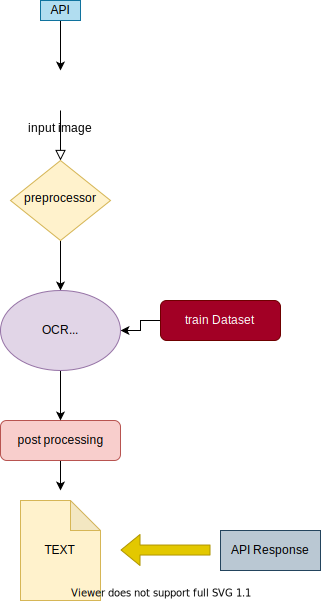

# visualization-and-data-preprocessing
## Tech Stack
1. Apache spark
2. apache beam or apache airflow
3. AWS
4. Flask
5. Postman
6. D3.js or Dash( Visualization tool)

# Scan and extract text from an image 
## Data Source
English Alphabet - https://www.kaggle.com/thomasqazwsxedc/alphabet-characters-fonts-dataset\
Hindi Character - https://www.kaggle.com/ashokpant/devanagari-character-dataset
more to add.....

# Architecture

